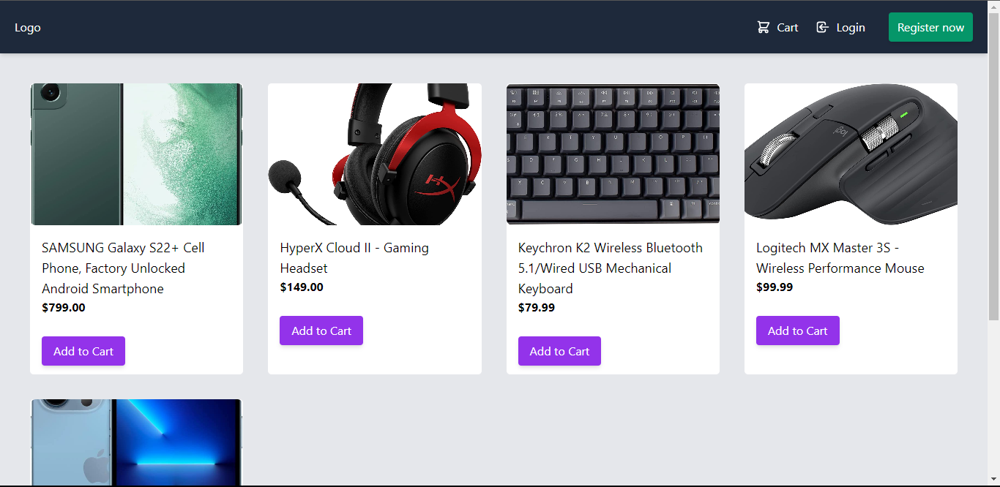
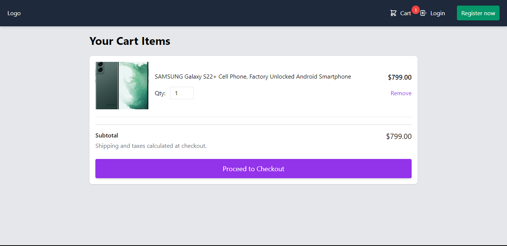
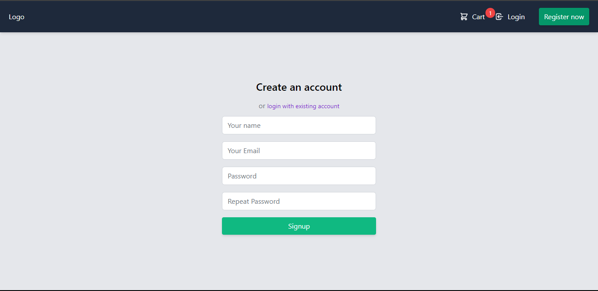
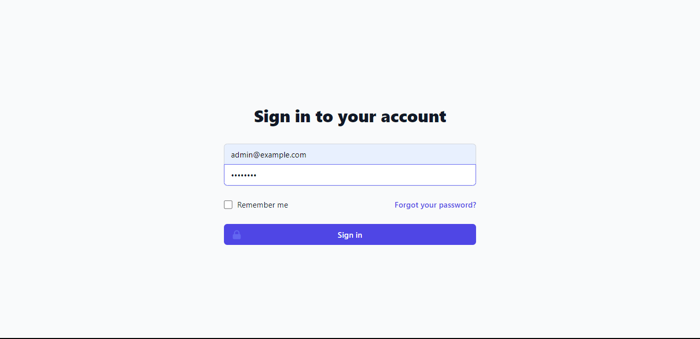
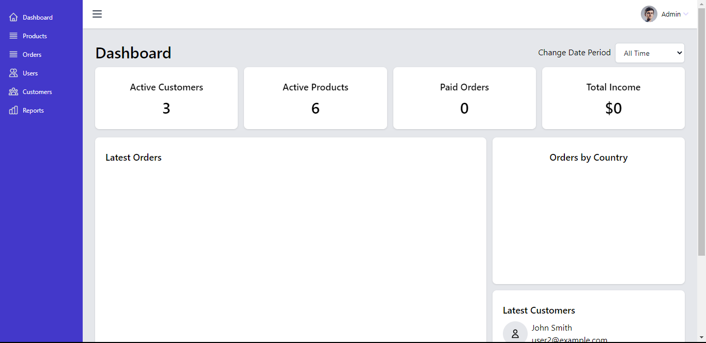
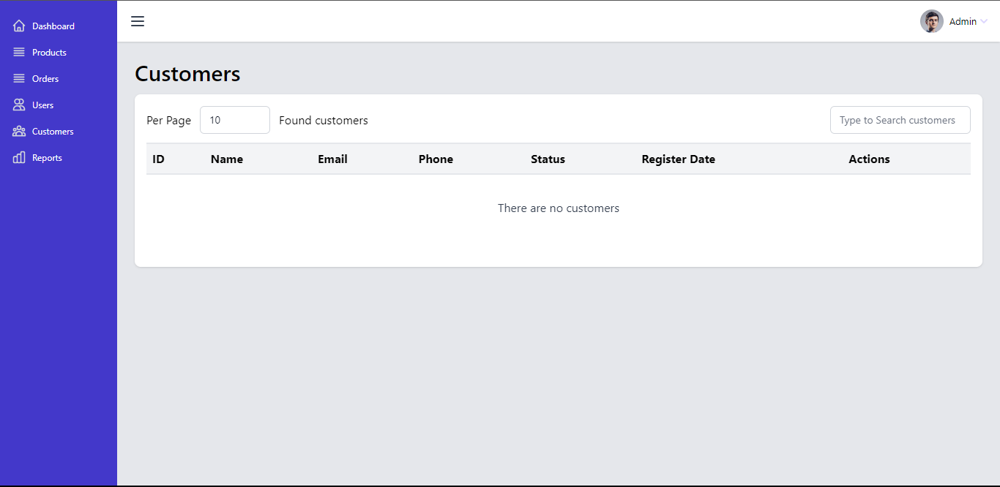
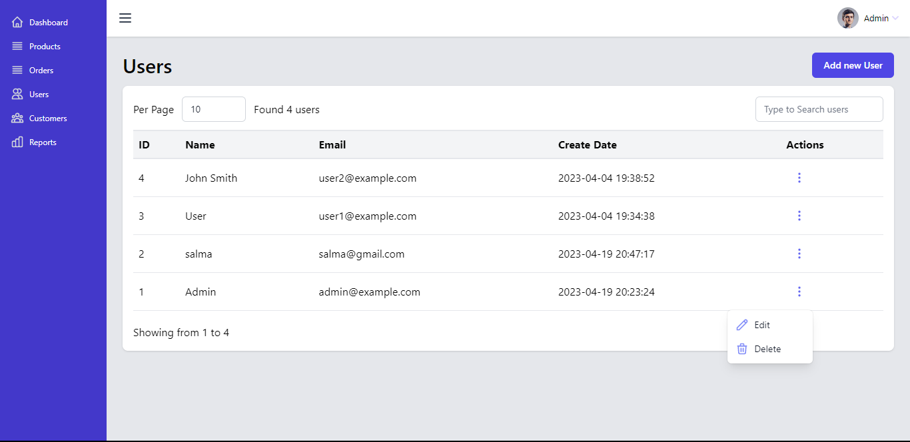
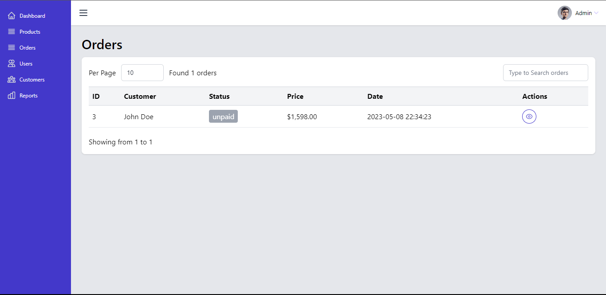
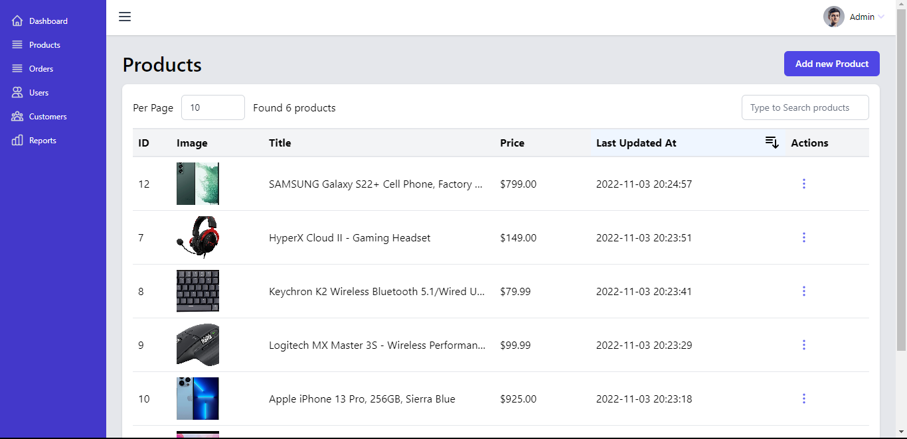

<h1 align="center"> Full Stack E-commerce Project </h1>

 E-commerce application built with Laravel, Vue.js, Tailwind.css and Alpine.js. 

## Screenshots:

 

### User (Store):

    
    
    

 
 

### Admin (Dashboard):

> If you want to try the dashboard yourself hit into tahe dashboard with this credentials. \
> ✉: admin@example.com . \
> 🔒: admin123. 
 
  
 

    
    
    
    
    
    

## Installation 
> Make sure you have environment setup properly. You will need [MySQL](), [PHP8.x>=](https://www.php.net/downloads.php) or LAMP/XAMP/WAMP server, [Node.js](https://nodejs.org/en/download) and [composer](https://getcomposer.org/download/) and [Mailhog](https://github.com/mailhog/MailHog) for local mail verification over SMTP protocol.

### Install Laravel Website + API
1. Download the project (or clone using GIT)
2. Copy `.env.example` into `.env` and configure database credentials
3. Navigate to the project's root directory using terminal
4. Run `composer install`
5. Set the encryption key by executing `php artisan key:generate --ansi`
6. Run migrations `php artisan migrate --seed`
7. Start local server by executing `php artisan serve`
8. Open new terminal and navigate to the project root directory
9. Run `npm install`
10. Run `npm run dev` to start vite server for Laravel frontend

### Install Vue.js Admin Panel
1. Navigate to `backend` folder
2. Run `npm install`
3. Copy `backend/.env.example` into `backend/.env`
4. Make sure `VITE_API_BASE_URL` key in `backend/.env` is set to your Laravel API host (Default: http://localhost:8000)
5. Run `npm run dev`
6. Lastley open Vue.js Admin Panel in browser
